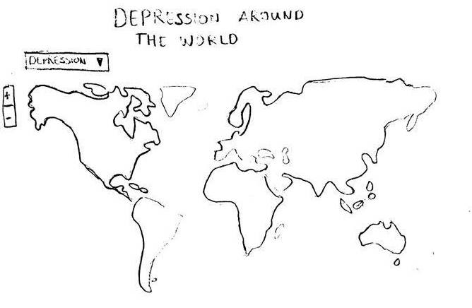

# Design

Eline Jacobse  
11136235

## Visualizations

###### **1: World map**

In this visualization I will show a world map with the percentage of people who are clinically depressed in each country. It will have a dropdown-menu where you have the option to select suicide rates, which will change the colors on the map. In order to allow users to explore the map in more detail, the map will also be zoomable.

An example of how I would like to implement this zooming feature can be found [here](http://www.billdwhite.com/wordpress/2013/11/26/d3-minimap-pan-and-zoom-demo/).

###### **2 & 3: Map of the Netherlands and ranking table**  

This will show a map of different regions in the Netherlands with the percentage of people who are depressed. From a dropdown-menu you can select to see rates of suicide in the different regions as well.

Above the map, you will see a search bar that allows you to search for a certain area. When you're typing, the search will show suggestions, and when you click the search icon or hit enter, the area will be highlighted on the map.

The map will be linked to a table on the right of the map. This table displays a sorted 'ranking' of the different regions, making it easy to see right away how the regions are compared to each other. When a different variable is selected from the dropdown-menu, the table will be resorted based on that variable (depression vs. suicide).  Additionally, the table will show how many mental health care facilities each region has.

###### **4: Line graph**

This graph goes into the cost of mental health care in the Netherlands more. It will display the amount of money that has been spent on mental health care in the last 10 years, so you can see how this has changed over time.  

###### **5: Bar chart**

As a conclusion to the page, I want to create a bar chart which shows countries that have lower rates of depression than The Netherlands. It will be sorter from highest rates of depression to lowest, starting with The Netherlands on the left.   

When you click on a bar, an information window will open showing more information about that country's mental health care system, highlighting in particular measures they've taken to help people with depression and prevent suicide.

## Other components

To make the website visually appealing, I want to create a large title header and an intro paragraph to introduce to topic to the visitor of the website. In the footer of my website, I will link to the GitHub page of my project, as well as the data sources used for the different graphs. An additional (possible) option for the footer is to link to a separate 'About' page, where I will give some background information on the project.

## Plugins and sources:

- [D3 Datamaps](https://datamaps.github.io/)  
To implement the world and map of The Netherlands, I will use datamaps.
- [Bootstrap](http://getbootstrap.com/)  
    I will use Bootstrap to create a basic layout for my website and for styling my table and different dropdown-menus.
- [Colorbrewer](http://colorbrewer2.org/#type=sequential&scheme=BuGn&n=3)  
To create a color scheme for my maps, I will use colorbrewer.

## Data sources

- From the [World Health Organization](http://apps.who.int/gho/data/node.main.MENTALHEALTH?lang=en) I will use the data of suicide rates around the world. They have complete datasets as both CSV and JSON files that I can download and use right away.
- I requested data from [Monitor Gezondheid](https://monitorgezondheid.nl/home.xml), together with GGD Nederland and Rijksoverheid they do nationwide surveys on (mental) health topics. They have data on depression and suicidal thoughts/suicide attempts from people in The Netherlands.
- Volksgezondheidenzorg.info (a website by Rijksoverheid) has [a tool](https://kostenvanziektentool.volksgezondheidenzorg.info/tool/nederlands/) that allows you to find individual costs of healthcare by diagnosis (which includes depression) starting in 2003. From the same website, I can also get information on the amount suicides by region in The Netherlands.
- [Research Paper: Burden of Depressive Disorders](http://journals.plos.org/plosmedicine/article?id=10.1371/journal.pmed.1001547#s4). This paper has data on the prevalence of depression for each country in the world. I can use this for both my world map and my final bar chart.
- [CBS Staline](http://statline.cbs.nl/Statweb/search/?Q=%22geestelijke+gezondheidszorg%22) has data on costs of healthcare in The Netherlands, which I will use for the line graph.
