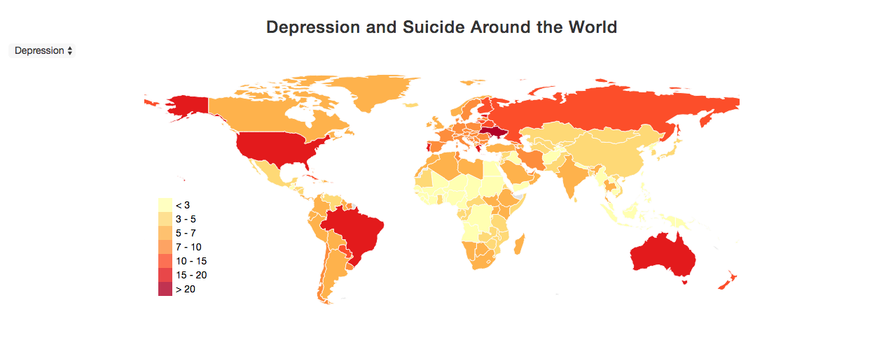
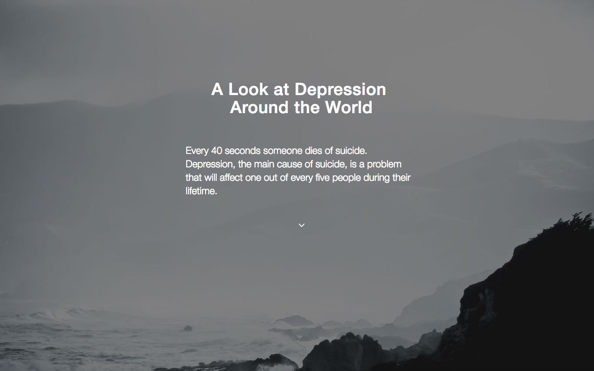

# Week 1
## day 1

I created my first proposal and sketches for my project.

## day 2  

Today I decided to change the focus of my story slightly. Instead of immediately showing a map of The Netherlands, I start out with a world map. This is to provide context to the problem of depression worldwide and to be able to see how depression rates in The Netherlands measure up to the rest of the world.

I have made a new sketch to visualize this idea, which includes the new world map at the top of the page. I also updated my README to include these new changes.  

## day 3

I gathered data for the world map (showing suicide rates and depression rates), and made a request
for data with Monitor Volksgezondheid. I decided to change the graph next to the map of the Netherlands, because I can't find data for the cost of health care in each region. Instead, I want
to look at usage of mental health care/the number of mental health care providers in each region.

During the morning stand-up I got the feedback that it should be clear which graphs are linked to each other (especially with the map of the Netherlands). With this in mind, I decided to change some of the visualizations I had in mind.

Instead of a bar chart next to my map, I now will have a sorted table, and my donut chart will be replaced by a line graph to show the costs of mental health care in the Netherlands throughout the last 10 years.  

I made new sketches:

I started coding, I now have a basic layout for my website (which is not functional yet.)

## day 4

My focus today was on creating a basic layout/format for my website, so I can create the interactive visualizations as soon as I have all the data. I now have the layout with the text and the different maps, I just have to add the line graph and bar chart. I also formatted the data of suicide rates in the World, which I can already use for my visualizations now.

The search function with the table is already functional, but the data I used now is the world suicide rates. I spent some time researching different layout options and using it to improve the structure of the site.

## day 5

I changed my idea of a line graph to a scatterplot, so I can show the relation between the costs spent on mental health care and the depression/suicide rates in different years. After presenting my project to the group, I got feedback on exploring the relation to suicide rates and depression in my scatterplot. Now this is not necessarily shown clearly in my map of The Netherlands.

From someone else from the group, I am going to get a topojson map of The Netherlands, which I can use instead of my SVG-map. This will allow me to use D3 datamaps with my map of the The Netherlands as well.

In regards to the website, I added the suicide data I already imported to the world map and created a color scale for this and the legend.

Before Monday, I plan to have formatted all my data so I can create my visualizations and have them all working with the right data.

# Week 2
## day 1

Today I started out with restructuring the files in my repository. I created folders for my css and javascript files, and created a separate javascript file with my functions, so it will be better organized. I formatted datasets about global depression rates, and added this to my world map. I also created a dropdown-menu and added functions to update the colors on the map.

From a classmate I received a topojson map of the Netherlands, which I imported into my website to replace my SVG-map. Tomorrow I will resize the map to fit the page well, and add the data to this map as well.

## day 2  

Based on on the fact that I have not received any data yet from Monitor Volksgezondheid (which I requested last week), I decided to change a large part of my website. Without this data, I won't be able to show the depression and suicide rates on a map of The Netherlands, like I'd originally planned. Working with data that I *have* found, I want to show several things differently on my site.

First of all, I want to have a line graph next to my world map, showing the change in rates of depression over the past ten years. This line graph will be linked to the world map, clicking a country on the map will highlight a line in the graph and the other way around. The example below is a different line graph, but in the same style as the one I want to make.

Below this, I still want to focus on The Netherlands, but in a different way. Instead of looking at different regions in The Netherlands, I want to look at the demographics of depression and the people who commit suicide. In a grouped bar chart, I want to show the different age groups on the x-axis and the rates of depression on the y-axis. You can select whether you want to show men, women, or the the total for both. I have other data I can show, but I am still unsure how to implement this.

Finally, I want to look at the health costs of depression in The Netherlands. I think I will want to display this in a pie chart, but I am not sure yet.

Today I also added a button (instead of a dropdown-menu) to my worldmap, and made my legend change when a new value is selected. Before I decided to change my website idea, I also got my topojson-map of The Netherlands to work (which will now be unnecessary).
 

## day 3

Today I made a style guide with my group. After this, I made new sketches for my website and asked someone from my group for feedback on my new ideas. I got the suggestion to focus my website on the world and not The Netherlands anymore, since it would be a better story that way.

After I created more sketches and decided what visualizations I was going to do differently now, I started on formatting data for the interactive line graph I want to add to the world map. I created a new file for the visualization and made a beginning with my line graph.

## day 4

I spent a large part of today formatting my dataset to create a line graph of depression from 1995-2015 around the world. I had trouble with this graph, because the line went from 1995 to 2005 and back to 2000, instead of doing this chronologically. I managed to find the problem and fix it, and finished the initial linegraph. I added buttons for the different continents, which allow you to highlight lines representing countries of a region in the linegraph. So far this works for the region of Europe and Central Asia, the rest of it I still have to fix.

Tomorrow I want to finish this part of the line graph and link it to my world map. I also want to start on my last visualizations.

And with one region selected:

## day 5

I slightly formatted my dataset to work with the line graph (selecting continents). I also made a quick new sketch for myself of the new layout I had in mind.

Before Monday, I want to have finished formatting my final datasets for all the visualizations and finalize my idea for the new visualizations.

# week 3
## day 1

I mostly worked on my line graph today, and finally got the tooltip and the continents to work. I also decided what my final visualizations will be and what I need to do for my MVP.

## day 2

I linked my world map to the line chart, and I asked feedback on my ideas for linked a third visualization to the rest of my website. I've decided to make a bar graph when you click on a country that shows the demographic of depression in that country. This will be displayed next to my line graph. I want to use an automatic scroll function that will scroll to the visualization of the bar chart and line graph when clicking on a country.

## day 3

I wrote a script to format my datasets for my barchart in Python, and I started working on the barchart. I also setup my website with GitHub Pages.

Screenshots of the website currently (without the header):

 

## day 4

I got my bar chart to work and linked it to both my line chart and the world map. When you click on the worldmap, it will scroll down to the other two visualizations where it changes the barchart (and title) to display demographics for the selected country.

## day 5

Today I spent most time on getting the grouped bar chart to work. I reformatted the dataset so I can use data from the different files (male and female depression rates), and I set up part of the bar chart. I couldn't fully get it to work yet, but I will finish it this weekend.

# Week 4

## day 1

Today I finished the grouped bar charts, which now also update for each country. I also animated the y-axis transition, instead of just creating a new one. I fixed the button of the world map (it now stays white when selected), and added info to the onhover of the World Map.

All continents on the line graph now work with the continent buttons. I also spent time on the layout, I added a main screen with an intro that will be the first thing you see when you open the website. I created new sketches for the final layout of the website.

## day 2

I finally fixed the bug in the line graph, where the lines would stay black after a new line was clicked. I also added some changes to the layout and my code, and started on the report.

## day 3

I worked on my report, which I mostly finished. I also sent a link of my website to some friends to ask them for feedback and make sure all functionality made sense. I had not included text with my visualizations yet, so I could find out by their responses if any of the visualizations needed instructions and what other points I should specify in the text.

I found out that:
- I should mention in my introduction to press F11 to ensure people use the website in fullscreen/presentation mode, which is what I designed it for.
- It was not obvious right away that you could click the map to go to the next screen. Without instructions people would just scroll down, and would not have thought to click on a country.
- One bug: the legend of the bar chart occasionally doesn't show text
- The grey I used for the lines in my line graph was hard to see if nothing was selected. It is good for highlighting countries, but a suggestion was that I make the color just a shade darker.
- I should emphasize in my text with the world map that the suicide rates are per 100,000 people, and the depression rates are in % of the population.
