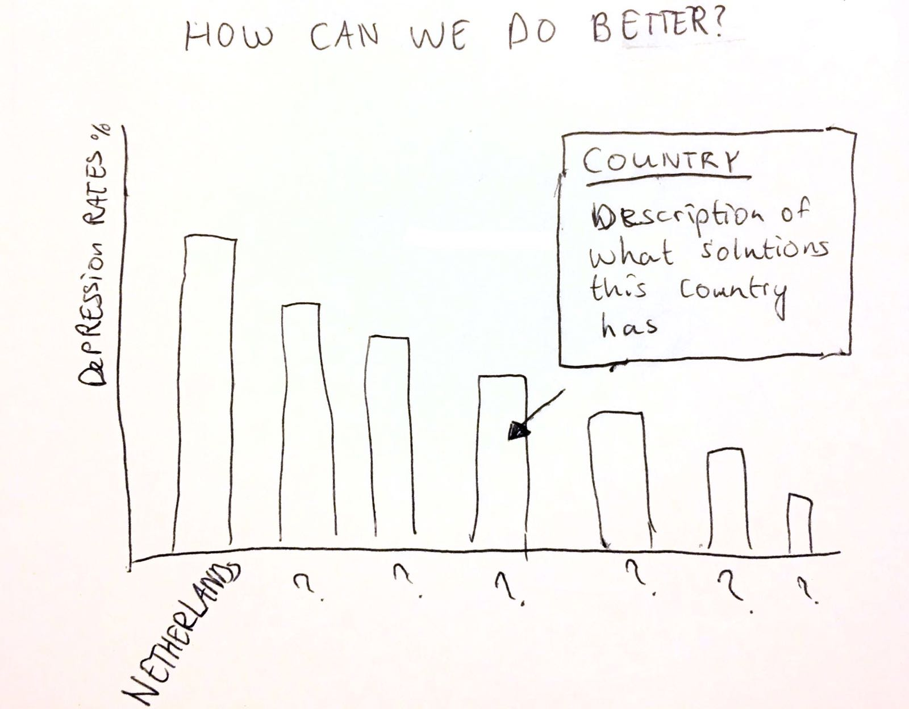

# day 1

I created my first proposal and sketches for my project.

# day 2  

Today I decided to change the focus of my story slightly. Instead of immediately showing a map of The Netherlands, I start out with a world map. This is to provide context to the problem of depression worldwide and to be able to see how depression rates in The Netherlands measure up to the rest of the world.

I have made a new sketch to visualize this idea, which includes the new world map at the top of the page. I also updated my README to include these new changes.  

# day 3

I gathered data for the world map (showing suicide rates and depression rates), and made a request
for data with Monitor Volksgezondheid. I decided to change the graph next to the map of the Netherlands, because I can't find data for the cost of health care in each region. Instead, I want
to look at usage of mental health care/the number of mental health care providers in each region.

During the morning stand-up I got the feedback that it should be clear which graphs are linked to each other (especially with the map of the Netherlands). With this in mind, I decided to change some of the visualizations I had in mind.

Instead of a bar chart next to my map, I now will have a sorted table, and my donut chart will be replaced by a line graph to show the costs of mental health care in the Netherlands throughout the last 10 years.  

I made new sketches:

I started coding, I now have a basic layout for my website (which is not functional yet.)

