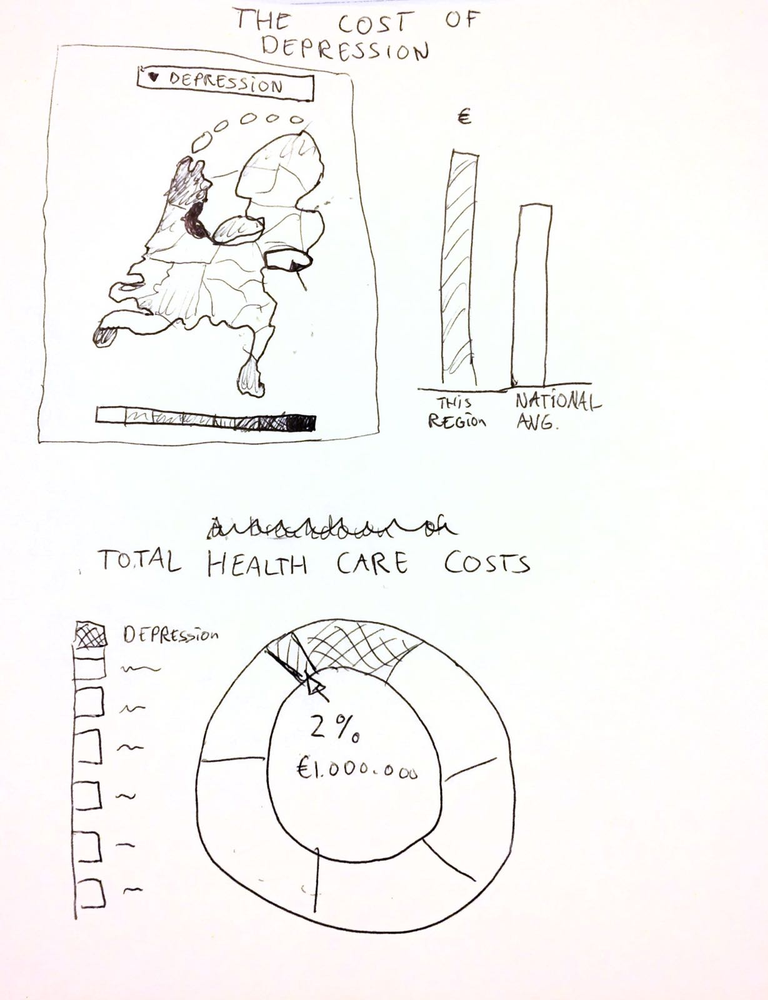
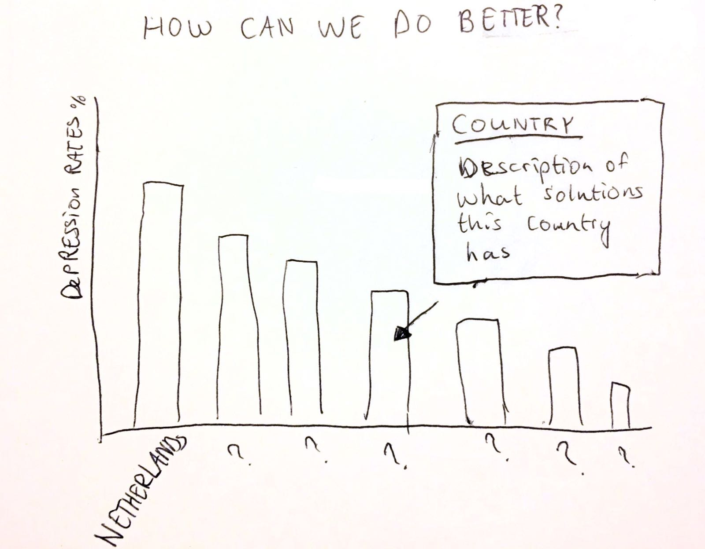
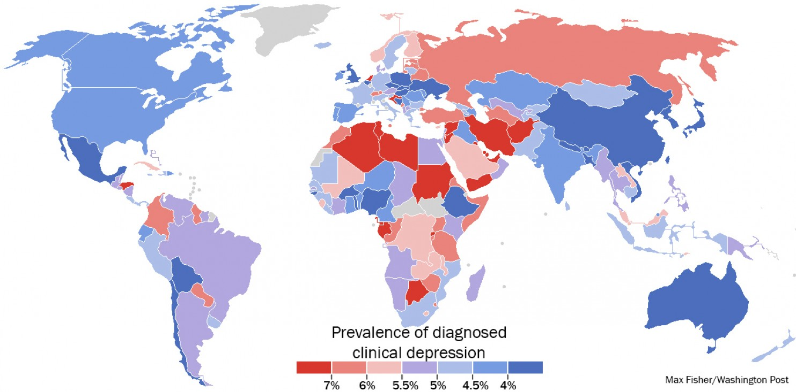
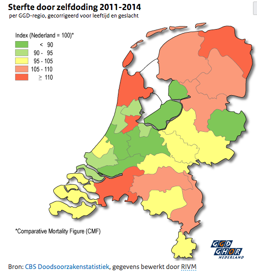
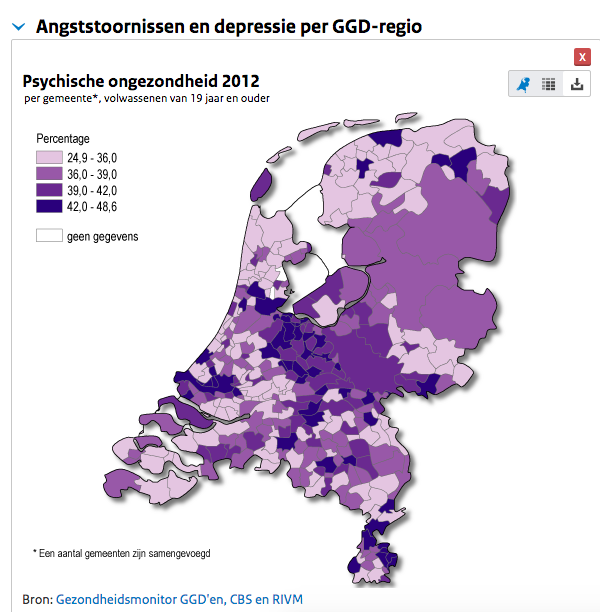

# Project

Eline Jacobse  
Student number: 11136235

## Introduction

Every [40 seconds](http://www.who.int/mental_health/suicide-prevention/en/) someone dies of suicide. Depression is the main cause

On out of five people will at some point in their life become depressed. In The Netherlands, depression and suicide rates have increased over the past ten years. This is not just a societal problem, it's a huge problem for the economy as well. It's estimated that depression costs The Netherlands 1,3 billion euros a year.

For my project, I will look at the cost of depression in The Netherlands, and show how this is affected by cuts to mental health care. I will also map the problem of depression by region, to see in which areas of the country the problem is the most prevalent.

### Visualizations

At the top of my website, I want to show a map of the Netherlands, which shows how many people in each region are depressed. From a dropdown-menu, you can choose to show the amount of suicides per region as well.

If you click on a region of the map, it will zoom in and a bar chart on the right of the map will display how much money (proportional to the total expenses of that region) was spent on mental health care in a particular year. It will also display a bar that shows the national average spending on mental health care, so you can compare each region to that.

Below this graph, the story continues. It another graph I will compare the costs of depression to other costs of health care in The Netherlands. This will show how relatively large the problem is on a national level.

Finally, I will end the story with a conclusion with possible solutions to this problem. I will do this by comparing depression rates in the Netherlands with countries with lower depression rates, and (when you click on a country) showing what countries with lower rates are doing differently in terms of mental health care.

### Sketches  

### Data Sources
Several sources I can use to find the data I need are: World Health Organization, CBS, Rijksoverheid, GGZ, LexisNexis, Nederlanse Zorgautoriteit, CIZ, Eurostat.

### Technical problems or limitations  

I have a lot of different aspects I want to show in my final project. Some of the interactive elements I want to use, are things I have never made before. This might cause a problem if I cannot get it to work well.

Another point to watch out for, is that I don't try to present too much information on the page. The story itself needs to be clear and every visualization needs to add something useful to the story. It needs to be clear and easy to understand for visitors of the website.

### Similar visualizations

The [Washington Post](https://www.washingtonpost.com/news/worldviews/wp/2013/11/07/a-stunning-map-of-depression-rates-around-the-world/?utm_term=.2ad431790650) has created a world map with the prevalence of depression in each country.

[Volksgezondheidenzorg.info](https://www.volksgezondheidenzorg.info/onderwerp/sterfte-naar-doodsoorzaak/regionaal-internationaal/niet-natuurlijk#node-sterfte-door-zelfdoding-ggd-regio) has made two visualizations that are similar to what I want to do. Below you see a map of the Netherlands showing the amount of suicides in each region. Next to it is a map of the risk of developing depression or an anxiety disorders in different counties.

These visualizations are similar to the map I want to create for my website, but they are both stand alone maps. You cannot select different variables to be displayed in the same visualization. My map will make it easier to compare the different variables by allowing the user to select which data they want to display, and have this shown in the same map.
