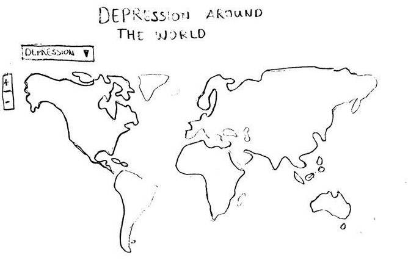

# Depression and Suicide Around the World

## Description

Every [40 seconds](http://www.who.int/mental_health/suicide-prevention/en/) someone dies of suicide. According to the World Health Organization (WHO), depression is something that will affect one out of five people during their lifetime.

Worldwide rates of depression have increased over the past ten years. My website looks at the depression and suicide rates around the world. It gives an overview of which countries have the highest rates of depression and suicide, what the trend of depression rates have been in each country and what the demographics

### Screenshots

### Sources

### Copyright
