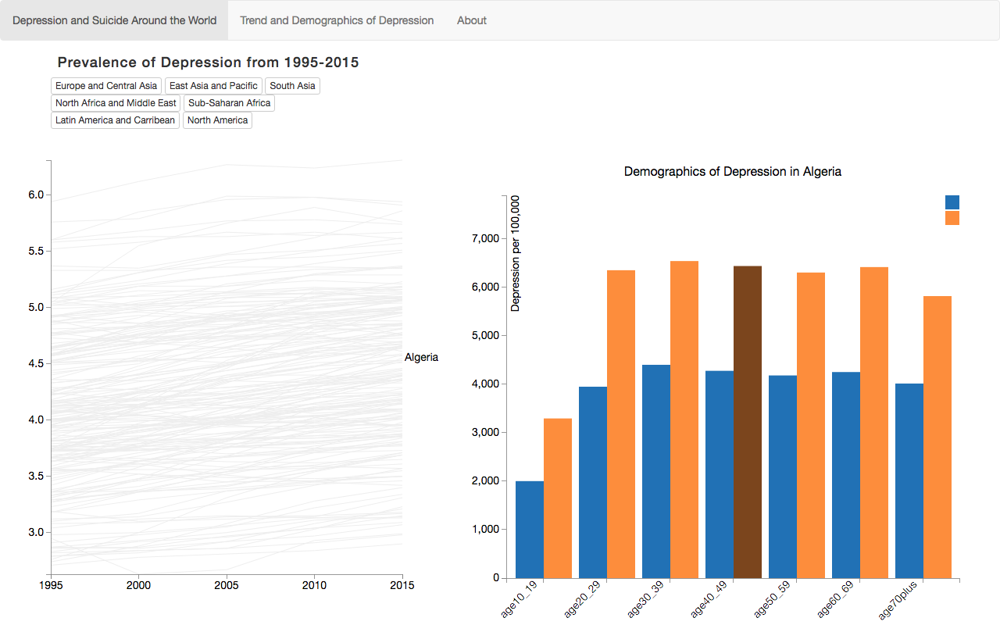

# Report

Eline Jacobse  
1612335

## 1. Description

Worldwide rates of depression have increased over the past ten years. My website looks at the depression and suicide rates around the world. It gives an overview of which countries have the highest rates of depression and suicide, what the trend of depression rates have been over the past 10 years and what the demographics of depression are in each country.

The website aims to create more awareness of depression and suicide, by allowing users to explore depression and suicide rates around the world through different visualizations.

## 2. Technical Design
### 2.1 Overview
My website has several components. When you open the website, you see an introduction. This is the title, with a short introduction on the topic. To go to the data visualizations, you click the arrow to automatically scroll down, or you can just scroll down yourself.

The first visualization is a world map, showing depression and suicide rates around the world. You can switch which data is displayed on the world map by clicking the button of 'Depression' or 'Suicide'. When you hover over the map, it will show a tooltip with the name, depression and suicide rates of that country.

If you click on a country, the website will scroll down to the next screen. Here it shows a line graph with trends of depression rates from 1995 to 2015. The line of the country you've clicked on will be highlighted. The bar charts shows the demographics of depression in a country by age group and gender.

In the line graph, you can hover over the different lines to see what country it is. Clicking a line will make it highlighted and this will update the bar chart.

Above the line graph, there are buttons for different regions in the world. If you select a button, all lines of the countries of that region will be highlighted in the line graph and the button will change color. This way, you can compare the different regions with each other. If you have selected a country in the line graph, you can easily navigate up with the up-arrow above the line graph, to see the selected country on the world map.

### 2.2 Implementation
My code is divided into several files containing functions for each visualization. In `main.js` I load the data for the world map using `d3.queue`, format this data and call the different functions that color the world map, make the line graph and the bar chart.

Initially, the world map is colored with the data of depression rates. When a user clicks on the button to select 'suicide', a function will be called to update the map with the new color values. I'm using the built-in function `updateChoropleth()` for this, by providing the function with the correctly formatted dataset (containing only `fillColors`).

For both datasets, I have created a separate `colorScale` functions, which use `d3.scale.quantile()` to take an inputted value and return the corresponding color from an array of colors that I use for the map.

Clicking on a country will make the page scroll down to the next visualization using jQuery, and it will call the function `updateBarchart()`, which gets the index of the selected country in the dataset, and updates the bar chart to reflect these change. It also calls the function `highlightLine()`, which adds a class 'clicked' to the line of this country.

In `styles.css` I've declared different colors for the classes of the lines. Hovering over the lines will add the class 'hovered', clicking on a line will add 'clicked', and by clicking on the buttons with the different regions the lines get a class corresponding to the region that's selected. This way the different interactions don't overlap or undo each other, since you can give each element multiple classes.

For the bar chart, I've used `d3-tip` to show the different values on hover. When the barchart gets updated, in the function `updateBarchart()`, I change the domain of the y-axis to the new data, link this data to the rects of the bars, and add a transition to animate this change. It will also update the title of the bar graph to the name of the country that's been selected.

Initially, the bar chart will show data from The Netherlands, and will be updated to other countries when they are selected. Hovering over the barchart will show a tooltip using `d3-tip`.

`functions.js` contains several helper functions that may be used by more than one of the visualizations.

## 3. Choices and Challenges
My final product is very different from what I had originally planned to do. The initial idea, as you can read in [`DESIGN.md`](DESIGN.md), was to look at depression and suicide on a global scale and then zoom in on The Netherlands. A map would show which areas in The Netherlands had higher depression and suicide rates, and an interactive table would allow users to search different areas to compare the rates of suicide and depression.

I had requested the data I needed for this from *Monitor Volksgezondheidenzorg*, but at the start of week two they e-mailed me that I would not be able to get this. They did have some data available, but it would cost me €150, and it would also not be region-specific, like I wanted.

### 3.1 Changing plans  

Because of the setback in receiving the data I needed, I let go of my idea of a map of The Netherlands. My new idea still included The Netherlands, but I wanted to look at trends instead. However, this idea didn't really fit well with my world map, because it wasn't a logical transition to go from a world map to trends in The Netherlands. This is when I decided to shift my entire plan, and focus *only* on depression around the world.

My new plan included ideas for several visualizations. First, I wanted to have a grouped bar chart that showed the demographics of depression by gender and age in a specific country. Next, I wanted to create a line graph that showed trends of depression in all countries, which allowed you to see a broader picture. Other ideas were a scatterplot with costs of mental health care vs. depression rates, and a pie chart which compared a country's spending on mental health care compared to other health sectors.  

The last two visualizations ended up being too much to do with the time that was left, so I created just the line graph and bar chart.

### 3.2 Linking the visualizations   

Once I was sure about my final visualizations, I ran into the problem of linking them in a good way. I wanted my visualizations to be big, so it would be easier to select elements or find countries on the world map. This did mean that my three visualizations didn't fit in one screen.

I had already linked my line graph to my world map, by highlighting countries and lines on hover. If it wouldn't be visible in one screen, however, this wasn't a useful feature. That's why I decided to change this from lines being highlighted on hovering, to the line being selected by clicking on a country. I also thought it would be intuitive to automatically scroll to this visualization when a country is clicked. If a user is interested in a country, clicking on it will show them more.

### 3.3 Creating a story  

It was important to me that all my visualizations added something relevant to my story. With my first idea, I had a very clear picture of how my visualizations would all come together to tell a story. With my changed plans, however, I found it harder to make all the elements come together in a logical way.

To figure out how to make it work, I created new (simple) sketches for my final layout. I wanted my introduction to stand out, which is why I created a homepage showing just in introduction text and the title. This forces the user to focus only on this paragraph of text, without being distracted by other elements on the screen. To guide the reader through the different parts of the story, I added up- and down-icons that scroll to the different parts of the site.

### 3.4 Colors  

In the first versions of my project I had colored the map with red colors. During the Friday presentations, I'd gotten the feedback from someone that they would use blue instead, since that's the color they would associate with depression. After looking into different options, I ended up going with the color scale I have now.

One problem with these colors, was that I had a white background and the lightest color blue was hard to see on the screen. I had already decided to use different background-colors (white and very light-grey) in the different sections, so to solve this problem I decided to make this section grey instead of white. This made the blue stand out more.

### 3.5 Technical challenges  

##### 3.5.1 Formatting the Data

Since I had never made a grouped bar chart, I couldn't figure out how to make it work with the way my data was formatted. In the end, I wrote a Python script to reformat my csv files to the right format, and then combined my two datasets (for male and female) depression rates in my Javascript to match the right format to create a grouped bar chart.

##### 3.5.2 Line graph
One of the technical challenges was to make the different elements work together, without one overriding the other. My line graph would not work well at first. If I clicked on a line, it would stay highlighted even after clicking on another one. Or it would show the country name, but not stay highlighted. Because this line graph works both with hover, click, buttons and the world map, it was difficult to make it all work smoothly.

In the end, I got advice in class to use D3's option for `.classed` selections. This made the problem a lot easier to solve.

##### 3.5.3 World Map
Getting the tooltip to work with `D3 Datamaps` was also a challenge. I needed to override the built-in popup-window. After doing this, I needed to manually add a tooltip to the datamap in an onhover function, which didn't work at first.

My idea was to show suicide rates when the map was colored for suicide values, and depression rates in the tooltip when depression was shown. However, because of the way the built-in function of DataMaps `updateChoropleth()` works, I colored the map with a dataset that didn't contain values, but fillColors instead. Once I had already implemented most of my website, I had no time to figure out a way around this so I could show different data in the tooltip. I chose to display both suicide and depression rates in the tooltip instead.

Another problem I ran into with `updateChoropleth()`, was that countries that didn't have data about suicide, didn't get a fillColor of grey (showing there is no data). Instead, it stayed the same color it was when the map was colored with depression data. I only found out about this once I got my tooltip to work. I solved this my writing a function that add a fillColor of grey to a country if there is no data.

### 3.6 Deciding what to leave out
Possibly one of the hardest challenges of this project was deciding what functions and ideas to leave out. I had data and ideas for two more visualizations, but this was unrealistic considering the time constraints.

It was also hard not to keep adding new features to my website. Especially after seeing other projects every Friday, I would be inspired to add new functionality to my website. One feature I had already made, was a menu bar with different headers showing where you were on the page. This would only show up after you'd scrolled past the initial page. Clicking on the different titles would take you to that section of the page.

Since I was very happy to have gotten this to work, it was hard to decide to delete this. I asked classmates for feedback, and decided that it was not very functional and only distracted from the story I was trying to tell. Especially since my page is not that long, it was not necessary to have this for navigation.

The same goes for an interactive table that I made in my first week. It had suicide data and allowed you to search for a particular country. I had meant for that to be linked to my map of The Netherlands, with the data I was hoping to receive. But since that plan fell through, I had to delete the table. I wanted to find a way to use it with my current website, but it just didn't fit or add anything.

One other idea I had was to scrape a dataset of suicide hotlines by country, and at the bottom of my page (at resources), display this number if it was selected.

For all of this, the challenge was to keep focusing on improving the elements that I already had, and not to get hung up on ideas for new features.

## 4. Decisions
Looking back on my process, I think changing the focus of my website from depression in The Netherlands to depression and suicide worldwide was the right decision. My website is a lot more cohesive and really tells a story. If I did have more time, though, I already have a list of improvements ready. Two main things are that I would want the country name to be displayed next to the line graph when you click on the world map, and that I would wrap the country names that you see when hovering over the line graph. Now they sometimes get cut off. I think finding improvements can be an endless process, since there are always ways to make things better. However, overall I am very satisfied with my final product, since it definitely achieves the goal I had in mind.
